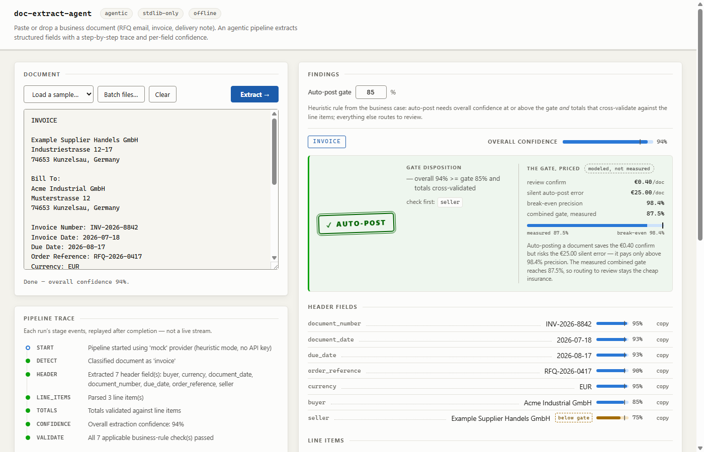

# doc-extract-agent

Picture a three-person AP & order-desk team keying ~60,000 supplier invoices, order confirmations, and delivery notes into the ERP by hand every year — four minutes a document, and a mistyped total only shows up later as a payment dispute. This is the loop that eats it: **it takes handling from ~4 minutes to under a second per document and frees on the order of €110k/yr of AP capacity** (modeled — see the business case), because only the documents that reconcile and clear a confidence gate post automatically, and the rest route to a human.

Paste a business document — an RFQ email, an invoice, a delivery note — and get structured data back: header fields, line items, and totals that are cross-checked against the line items, each with a confidence score, a layer of field-level business-rule checks (per-line and total arithmetic, required-field completeness, IBAN/VAT format), and a step-by-step trace of how it got there.



This is the "unstructured document in, structured record out" loop that sits under a lot of Data & AI automation work, and I built it while learning that space for internship applications. It complements a sibling project, `agentic-automation-lab`. Everything runs on Python's standard library — no dependencies, no API key, no build step.

**Business case:** [`docs/BUSINESS_CASE.md`](docs/BUSINESS_CASE.md) — the AP scenario, the arithmetic behind the numbers above, and the confidence-gate behaviour, with a one-page [executive summary PDF](deliverables/executive_onepager.pdf).

## Running it

```bash
python -m docextract.server
```

Open http://127.0.0.1:8000, pick a sample from the dropdown or paste your own text, and hit Extract. There's also a small HTTP API:

```
POST /extract        {"text": "<document text>", "gate_threshold": 0.85}
                     →  {doc_type, fields, line_items, totals, confidence, validation, gate, trace}

POST /extract/batch  {"documents": [{"name": "a.txt", "text": "..."}, ...], "gate_threshold": 0.85}
                     →  {results: [{name, ...same shape as /extract}], summary: {documents, auto_post, review, gate_threshold}}
```

`gate_threshold` is optional (default 0.85); a batch takes up to 50 documents and shares the 1 MB request limit.

Or call the engine directly:

```python
from docextract import evaluate_gate, extract_document

result = extract_document(open("samples/invoice.txt").read())
print(result["doc_type"])                     # "invoice"
print(result["totals"]["validated"])          # True
print(evaluate_gate(result)["disposition"])   # "auto_post"
```

## What runs when you hit Extract

A six-stage pipeline, and each stage emits a trace event so you can watch it work: `detect` classifies the document, `header` pulls parties/dates/currency/reference numbers, `line_items` parses the table, `totals` extracts the stated totals and cross-checks them against the summed line items, `confidence` rolls everything into one score, and `validate` runs a field-level business-rule layer over the finished record (below). Results copy to the clipboard (per field, or all fields as a tab-separated block that pastes into Excel/an ERP form) and export as JSON or CSV — line items only, or the full record (header fields + totals + line items) as one importable table. Ctrl+Enter extracts without leaving the textarea.

Every result is then stamped by the **confidence gate** — the heuristic rule from the business case, now implemented: auto-post requires overall confidence at or above the gate (default 85%, adjustable in the UI and per API request) *and* totals that cross-validate against the line items. Everything else is marked **needs review** with the specific reasons, and every below-gate field is flagged so a reviewer knows what to check first. A document with no monetary totals — an RFQ, a delivery note — always routes to review; flagged fields never change the disposition, they just mark where to look.

Alongside the confidence gate, every result also runs through a **business-rule validation** layer — the structural check an AP clerk does by eye before posting. It re-derives nothing; it reuses the numbers already extracted and asserts they hang together: each line's `quantity × unit_price = amount`, `subtotal + tax = total`, the line items reconcile to the stated total (reusing the totals cross-check), the mandatory header fields for the document type are all present, dates are in order, and a labelled IBAN passes its ISO 13616 mod-97 checksum (a labelled VAT id is shape-checked per country). Each rule reports pass / fail / skip; any hard failure sets `review_recommended`. This is the layer that catches what confidence structurally can't: a *silently dropped* field lowers no confidence average, but the required-field rule turns that omission into an explicit review signal. The measured effect is [below](#the-structural-second-gate-business-rule-validation).

For the stack-of-emails case there's a **batch mode**: drop several `.txt`/`.eml` files onto the textarea (or pick them with "Batch files…") and they're all extracted in one request. You get a results table — file, type, document number, overall confidence, auto-post/review per document — any row opens into the full trace and result panels, and two combined exports: one CSV of full records across all documents (prefixed with source file and gate disposition) and the whole batch as JSON. `.eml` files are read as plain text; there's no MIME or quoted-reply cleanup yet.

## The two bugs that made me write real tests

The parsing looks straightforward until you actually run it against realistic samples, and two things bit me:

**"VAT (19%): 19.95" extracted the tax as 19.** My first tax regex just grabbed the first number after the VAT label, so it happily returned `19` — the percentage — instead of `19.95`, the actual amount. The fix was to require a colon before the number so the `(19%)` in parentheses gets skipped. There's now a test pinning `tax == 19.95` specifically so this can't regress.

**"Subtotal: 105.00" was being read as the Total.** A bare `\bTotal` pattern matches inside the word "Subtotal", so the total field kept picking up the subtotal value. I added a negative lookbehind (`(?<!Sub)`) so `Total` only matches when it isn't the tail of `Subtotal`. Both figures now come out separately, and the totals validation catches when the line-item sum doesn't reconcile.

The number parsing has its own share of this — it has to handle both `1.234,56` (EU) and `1,234.56` (US) and decide which separator is the decimal — which is the other place the tests earn their keep.

## Measured extraction quality

Claims like the ones above deserve numbers, so the repo ships a labelled evaluation set — 27 synthetic-but-realistic documents (13 invoices, 8 RFQ emails, 6 delivery notes) with deliberate edge cases: missing and mismatched totals, multi-currency mentions, non-ISO date formats, EU thousands separators, unicode company names, noisy phrasing, partial deliveries. It's generated deterministically (`python -m eval.make_dataset`, fixed seed, committed under `eval/dataset/`) and scored with `python -m eval.run_eval`, which writes `eval/results.json`. This is the measured output on that set:

```
== doc-extract-agent evaluation (mock pipeline) ==
Documents: 27 (delivery_note 6, invoice 13, rfq 8)

-- Document type detection --
correct 27/27 (100.0%)

-- Header fields (exact match) --
field                      expected  correct  accuracy  spurious
buyer                            27       26     96.3%         0
currency                         19       18     94.7%         2
document_date                    26       24     92.3%         1
document_number                  27       27    100.0%         0
due_date                         13       12     92.3%         0
order_reference                  18       18    100.0%         0
requested_delivery_date           8        7     87.5%         0
seller                           19       19    100.0%         0

-- Stated totals (numeric, +/-0.01) --
total                      expected  correct  accuracy  spurious
subtotal                         11       11    100.0%         0
tax                              11       11    100.0%         0
total                            12       12    100.0%         0

-- Line items (matched by description; qty/unit/price/amount must all match) --
tp 56  fp 5  fn 6  precision 91.8%  recall 90.3%  f1 91.1%

-- Per document type --
type              docs  fully correct  field acc  item f1
delivery_note        6              3      96.5%    96.3%
invoice             13              9      96.7%    83.9%
rfq                  8              4      94.6%   100.0%
all                 27             16

-- Confidence gate @ 0.85 (operating stats) --
auto-posted:       10 docs, 7 fully correct -> auto-post precision 70.0%
  posted WITH errors: inv08_weird_dates, inv09_multicurrency, inv10_eu_thousands
review-flagged:    17 docs, 8 with real extraction errors, 9 extraction-clean (held for unreconciled or absent totals)

lowest threshold with 100% auto-post precision: 0.9393 (auto-post volume drops to 4 of 27 docs)
```

To make *why* it fails measurable rather than described in prose, the same run groups every imperfect document by symptom — this breakdown is computed by the harness and regenerated with the numbers above:

```
-- Failure modes (imperfect documents grouped by symptom) --
mode                     docs  occurrences   documents
date_not_parsed             3            4   dn04_weird_date, inv08_weird_dates, rfq04_weird_date
line_item_values_wrong      2            5   inv10_eu_thousands, inv13_no_amount_column
currency_spurious           2            2   dn03_no_order_ref, rfq06_multicurrency
currency_misinferred        1            1   inv09_multicurrency
date_spurious               1            1   rfq03_noisy_no_header_date
line_item_row_missed        1            1   dn06_partial_delivery
party_over_capture          1            1   rfq08_inline_deliver_to
16 of 27 documents fully correct; 11 imperfect across 7 failure modes; most common: date_not_parsed (3 docs)
```

Every one of the 11 imperfect documents is accounted for by exactly one symptom (the field- and line-item counts reconcile with the accuracy tables above — a test pins this), so the single biggest lever is date parsing: **silent non-ISO date drops account for the most affected documents**, and column-format misreads (`1.000` as a thousands separator, a missing amount column) are the costliest per document.

The honest reading:

- **Only 16 of 27 documents come out fully correct.** Labelled identifiers (document numbers, order references, ISO dates, stated totals) are near-perfect; what fails is exactly what regexes can't see: **non-ISO dates** (`18.07.2026`, `21 July 2026`, `01/09/2026` are all silently dropped), **currency by inference** (an invoice that says "all prices in USD" in prose gets tagged `EUR`; a delivery note with no currency at all gets a spurious `EUR` because a line item is literally named "Pallet EUR 1200x800"), **EU thousands separators in quantities** (`1.000` parses as 1.0), and **prose-polluted columns** ("480 of 500" drops the row).
- **The gate's auto-post precision at the default 0.85 threshold is 70%, not 100%.** 10 documents auto-post; 3 of them carry real extraction errors. The reason is structural: a field the regex *silently misses* doesn't lower the confidence average (the score only aggregates over what *was* extracted), so a document with a dropped date can score *higher* than a clean one. Confidence catches parse uncertainty, not silent omissions.
- **What the gate does catch is real:** all 8 documents with broken line items or unreconciled/mismatched totals were held for review — the cross-validation rule (not the confidence score) did that work, including an invoice whose printed totals simply don't add up.
- **Sweeping the threshold: 0.94 reaches 100% auto-post precision on this set, but volume collapses from 10 to 4 documents.** That trade-off (and the fact that a threshold can't see silent misses at all) is the argument for the structural checks that now back the confidence gate — per-doc-type required-field checks and per-row `quantity × unit_price = amount` validation — implemented as the business-rule layer and [measured below](#the-structural-second-gate-business-rule-validation).

### The structural second gate: business-rule validation

Confidence grades the *parse*; the validation layer grades the *record*. Run over the same 27 documents (`python -m eval.run_eval`), the business rules leave 21 clean and flag 6 for review:

```
-- Business-rule validation (structural checks over the extracted record) --
documents clean 21/27, flagged for review 6: dn04_weird_date, inv08_weird_dates, inv10_eu_thousands, inv11_missing_totals, inv12_totals_mismatch, inv13_no_amount_column
rule                      run  pass  fail  skip   documents flagged
required_fields            27    24     3     0   dn04_weird_date, inv08_weird_dates, inv11_missing_totals
line_total_reconciles      12    10     2    15   inv12_totals_mismatch, inv13_no_amount_column
totals_arithmetic          11    11     0    16   -
line_item_math             31    29     2    30   inv10_eu_thousands
date_order                 19    19     0     0   -
iban_checksum               0     0     0    27   -
vat_format                  0     0     0    27   -
combined gate (confidence gate AND all business rules): auto-post 10 -> 8 docs, precision 70.0% -> 87.5%
  validation caught 2 of 3 gate auto-post errors: inv08_weird_dates, inv10_eu_thousands; still missed: inv09_multicurrency
```

The honest reading:

- **This is the fix for the confidence gate's blind spot, measured.** The gate alone auto-posts 10 documents at 70% precision; requiring the business rules *as well* raises that to **87.5%** — because `required_fields` catches `inv08`'s silently dropped non-ISO date and `line_item_math` catches `inv10`'s misparsed `1.000` quantity (`1 × 0.12 ≠ 120.00`), the two silent errors the confidence average could never lower.
- **It is not a cure-all, and the number says so.** The third gate error, `inv09`, is a currency mis-inferred from prose (`EUR` where the invoice settles in `USD`) — a plausible wrong *value*, not a broken sum, so no arithmetic or format rule can see it. Combined precision is 87.5%, not 100%.
- **Structural checks beat simply tightening the threshold.** To reach the same 8-document auto-post volume by raising the confidence gate alone you land near 0.9345, which posts only 75% correct (6 of 8); the validation layer holds that volume at 87.5% because it removes the *specific* broken documents instead of blunt-trimming by score.
- **`iban_checksum` and `vat_format` never fire on this set** — the synthetic documents carry no bank details, so both rules skip all 27. They are exercised instead by unit tests with hand-verified IBAN vectors (a valid `DE…`/`GB…`/`FR…`/`NL…` and a one-digit corruption) and per-country VAT shapes; on a real remittance advice they would run.
- **The layer checks format and internal consistency, not truth.** The VAT rule verifies the country shape, not that the number is live in VIES; the IBAN rule verifies the ISO 13616 checksum, not that the account exists. It is a pre-post sanity net, informed by the same rules a clerk applies — not a certification.

### What a silent error actually costs: the gate priced in euros

Precision percentages only become decisions when they meet prices, so the repo ships a cost model (`python -m eval.run_cost`) that joins the two things it already has: the **measured** operating point of every gating policy (from `eval/results.json`) and the **modeled** cost parameters the business case documents (€32/h clerk, 4-minute manual keying with 3% errors, €25 per silent error, 45-second pre-filled review = €0.40). Three mechanisms, nothing hidden: a hand-keyed document costs keying labour plus expected keying errors; a reviewed document costs the €0.40 confirm (and is assumed corrected there); an auto-posted document is free when right and €25 when silently wrong. The run prices every policy the harness measured and writes `eval/cost_results.json`:

```
-- Policies (measured mix priced per document and scaled to annual volume) --
policy                    auto  errors  review   EUR/doc         EUR/yr      vs manual
manual_keying                -       -       -    2.8833     173,000.00              -
auto_post_everything        27      11       0   10.1852     611,111.11    -438,111.11
gate_only                   10       3      17    3.0296     181,777.78      -8,777.78
gate_plus_validation         8       1      19    1.2074      72,444.44    +100,555.56
strict_gate_100pct           4       0      23    0.3407      20,444.44    +152,555.56
review_everything            0       0      27    0.4000      24,000.00    +149,000.00

-- Break-even: when does skipping the 45-second review pay? --
auto-posting a document saves the EUR 0.40 review and risks EUR 25.00 per silent error
-> auto-post pays only above 98.4% precision
```

The honest reading of the euros:

- **The confidence gate alone would lose money on this set.** €181,778/yr modeled vs. €173,000 manual — 3 silent errors per 27 documents (≈6,667/yr at scale) at €25 each outweigh the 10 skipped 45-second reviews. Automation that silently posts wrong documents is *worse than no automation*, now in a number rather than a sentiment.
- **The business-rule validation layer is worth ≈ €109,333/yr in this model** — the entire gap between gate-only (€181,778) and gate + validation (€72,444) comes from the two silent errors it structurally catches. This is the euro version of the 70% → 87.5% precision lift.
- **Auto-posting a document pays only above 98.4% precision** (it saves €0.40 and risks €25: break-even at 1 − 0.40/25). No measured policy clears that bar credibly — gate-only (70%) would need errors to cost under €1.33, gate + validation (87.5%) under €3.20, and the strict 0.94 threshold's "100%" rests on 4 auto-posted documents, far too small a sample to establish 98.4%.
- **So the model's actual recommendation is the unglamorous one:** extract and pre-fill everything, auto-post almost nothing. The cheapest measured policies are the strict gate (€20,444/yr) and review-everything (€24,000/yr) — meaning nearly all the value is the pre-fill (4 minutes → 45 seconds, €149,000/yr of the saving) and at most a few thousand euros come from skipping confirms. The €110k headline in the business case sits inside the measured-mix range (€100,556/yr with the combined gate, €152,556/yr for the strict gate).

Caveats, in the same spirit as the rest of this README: the euros are **modeled, not measured** — the parameters are the business case's synthetic estimates; the 27-document set deliberately over-represents edge cases, so a real document mix should show higher precision and cheaper policies; reviewed documents are assumed fixed within the 45-second confirm (real rework takes longer); and scaling a 27-document mix to 60,000 documents/yr is an illustration, not a forecast. The arithmetic itself is exact as computed, deterministic, and pinned by tests.

### Is the confidence score honest? (calibration)

The confidence numbers are hand-picked constants (a labelled currency is 0.95, a heuristic seller 0.75, a symbol-inferred currency 0.6, and so on), so the next honest question is whether they *mean* anything: when the extractor says 0.75, is it right about 75% of the time? The same run now measures that directly — it pairs every **extracted** value with whether it was actually correct against the label, then bins by the stated confidence:

```
-- Confidence calibration (per extracted prediction, correct vs. stated confidence) --
predictions 251  accuracy 96.0%  mean confidence 88.3%  gap -0.0767
ECE 0.0878  MCE 0.5000  Brier 0.0444  (gap>0 = over-confident)
 stated conf  preds  correct  empirical      gap
        0.50      2        2     100.0%   -0.500
        0.60      4        1      25.0%   +0.350
        0.75     19       19     100.0%   -0.250
        0.80     30       30     100.0%   -0.200
        0.85     30       26      86.7%   -0.017
        0.90     55       55     100.0%   -0.100
        0.93     37       36      97.3%   -0.043
        0.95     64       62      96.9%   -0.019
        0.99     10       10     100.0%   -0.010
by source:
  field      preds 156  accuracy  96.8%  mean conf  88.4%  gap -0.0839
  line_item  preds  61  accuracy  91.8%  mean conf  87.1%  gap -0.0467
  total      preds  34  accuracy 100.0%  mean conf  90.3%  gap -0.0971
```

The honest reading of the calibration:

- **On average the constants are *under*-confident, not over-confident** (mean confidence 88.3% vs. 96.0% actual accuracy; gap −0.077). The conservative buckets earn it: everything the extractor stated at 0.75 (heuristic seller) or 0.80 (quantity-only line items) was correct on this set. So the constants are pessimistic where the parse is actually reliable.
- **Exactly one bucket is over-confident, and it is the known-bad one:** the 0.60 currency-by-symbol/keyword fallback is right only **25%** of the time (1 of 4). That is the same currency-mis-inference/spurious failure mode from the breakdown above, now showing up as a calibration defect — the fallback should be trusted far less than 0.60.
- **The worst single miscalibration (MCE 0.50) is a deliberate one:** the 0.50 "totals did not reconcile" figures were all extracted faithfully (100% match to what is printed), but their confidence is halved on purpose because they failed cross-validation. That 0.50 is a *reconciliation* signal, not an *extraction-correctness* signal — a useful distinction the number alone hides.
- **Calibration is blind to the biggest real failure.** These 251 points are only the values that were *extracted*; a silently dropped non-ISO date emits no confidence at all, so it never appears here. That is why extracted-prediction accuracy (96.0%) sits so far above the document-level fully-correct rate (16 of 27, 59%): confidence can grade what it attempted, not what it silently skipped — the measured version of the point made two bullets up.

ECE (0.088) and Brier (0.044) summarise this as "close on average, with one genuinely broken bucket"; a test pins the headline numbers and the over-confident-currency finding so they can't drift.

## Limitations

- The extraction is a deterministic heuristic (regex plus column-aware table parsing), not a real LLM. That's on purpose — it keeps the demo offline and reproducible — but it's tuned for clean, well-structured documents.
- Messy scans, OCR noise, multi-page tables, unusual layouts, or languages outside the sample style will drop or miss fields.
- For production, the pipeline is already built around an `LLMProvider` interface. Set `DOCEXTRACT_PROVIDER=anthropic` (plus `ANTHROPIC_API_KEY`) and each stage routes its extraction through a real model — the stages, trace, confidence, and validation logic stay put.

## Tests

```bash
pip install pytest ruff
ruff check .
pytest -q
```

The suite runs the three shipped samples end to end, feeds the pipeline garbage to check it never crashes, and covers the evaluation harness: dataset generation is byte-for-byte deterministic (and the committed set is verified against a fresh regeneration), the scorer is checked on a hand-verified document pair, the gate's operating stats are recomputed from the per-document results, the failure-mode breakdown is checked to cover exactly the imperfect documents and to reconcile with the per-field accuracy table, and the confidence calibration is checked both on hand-verifiable arithmetic and on the committed set (the reliability table partitions every extracted prediction, and the over-confident currency-fallback bucket is pinned). The business-rule validation layer has its own suite — each rule's pass/fail/skip path on hand-built records, the ISO 13616 IBAN vectors, the VAT-id-vs-tax-line disambiguation, the warning-doesn't-force-review split, a collapses-to-base-case check (a clean invoice passes every rule) and the measured combined-gate precision lift (70% → 87.5%) pinned against the committed results. The cost model has its own suite too: the business-case anchors recomputed by hand (€0.40 review, €2.8833/doc and €173,000/yr manual baseline), each policy's per-document cost checked against its exact fraction, break-even consistency (at exactly the break-even precision the expected error cost equals the review cost saved), collapse-to-base-case checks (free errors leave only review labour; a review priced at the full keying time reproduces the manual baseline), input validation, determinism, and the committed `eval/cost_results.json` verified byte-for-byte against regeneration. Regenerate the numbers any time with `python -m eval.run_eval` followed by `python -m eval.run_cost`.

## Next

The structural blind-spot fix is now in place — the business-rule layer above closes two of the three confidence-gate misses. What it can't close is `inv09`'s currency mis-inference (a wrong-but-plausible value no rule can see), so the next steps sit on the extraction side: down-weight the 0.60 currency fallback to match its measured 25%, and prefer the *last* stated currency over the first so an invoice that settles in USD stops reading as EUR — then run the same documents through the Anthropic provider to diff its output against the heuristic. Beyond format-checking, wiring the VAT rule to a live VIES lookup and the IBAN to a bank-directory check would turn today's shape checks into real verifications.

---

© 2026 Dimitres Kisimov — all rights reserved; published for portfolio review. See LICENSE.
